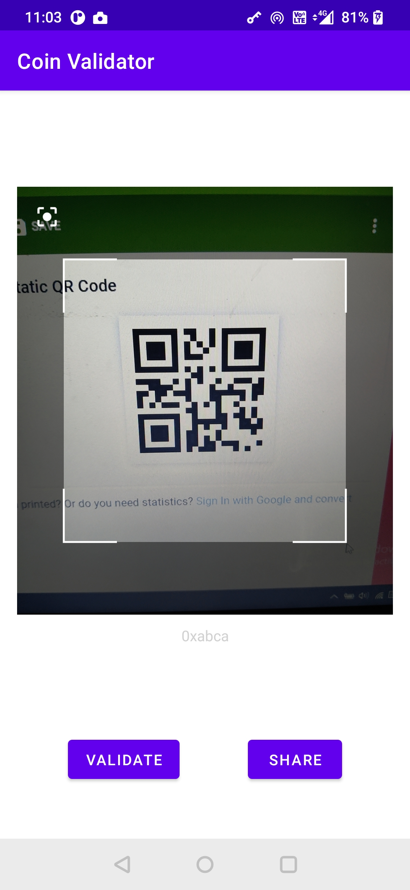
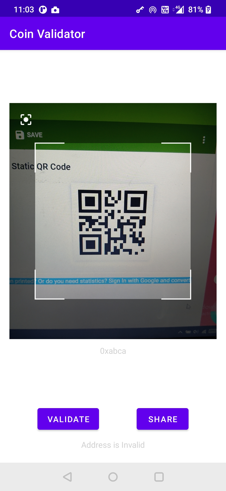

## CoinValidator
    A Qr code scanner app which scan the qr code for Bitcoin and etherium address and helps in validating if they are right
    address or not.
    Also if address is valid, it can be shared to differnent applications.
    
    How Validation works:
    1. BTC Validation Rules:
      •	A Bitcoin address is between 25 and 34 characters long;
      •	the address always starts with a 1
      •	an address can contain all alphanumeric characters, with the exceptions of 0(zero), O(Capital o), I(small L), and l(Capital i).
    2. ETH Validation Rules:
      •	String should begin with 0x and contain numbers between 0 to 9 and a to f

## Library used
- [Code Scanner](https://github.com/yuriy-budiyev/code-scanner) Code scanner library for Android, based on ZXing.
- [Assent](https://github.com/afollestad/assent) Android Runtime Permissions made easy and compact, for Kotlin and AndroidX. With coroutines support! 

## Screen 

 

  
   
  

## Demo
- [Video](https://drive.google.com/file/d/1zJvcndUi1urtjGdG7R3NAuFm5QCicB71/view?usp=sharing) video
- [Apk](https://drive.google.com/file/d/14U5hwojwHKdjCFpDERYamxBD4EBfOtX-/view?usp=sharing) Apk
